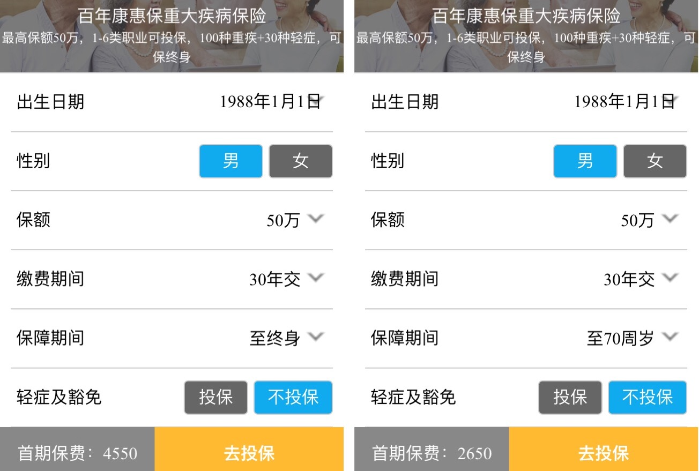
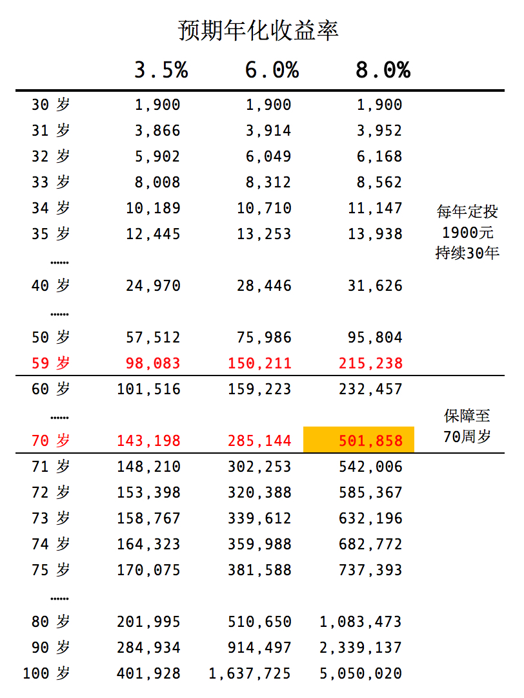

# 是否需要选择终身重疾险

## **重大疾病保险的保障期间**

一般有两种：

1. **定期**（保障到70周岁、80周岁，或保20年、30年等）
2. **终身**（保障终身，无期限限制）

一般情况下，定期重疾的价格相对比较便宜，保障终身则会贵很多。那么，应该如何选择保障期间？太多人在定期和终身两个选择上纠结，所以有的购买建议干脆直接给出了买定投余的方案，避免投保人过于纠结。也有相当多的人直接建议购买长期重疾获得永久保障。

**这篇文章将以一个投保实例进行解析，教你选择定期或终身的方法。**内容包括：

* 买定投余是什么？
* 买定投余是否适用？
* 正确的选择方法是什么？

## **买定投余是什么？**

买定投余就是建议购买定期保障，然后把相比购买终身保障节省下来的资金进行投资理财，等定期保障到期后（比如70岁），虽然没有了保障，但是节省下来的保费加上投资收益已经是很大一笔钱了，这笔钱可以兼顾治病与养老作用，即为自己提供保障。

## **投保实例演示**

以当前市面上一款性价比很高的重疾险为例（这里强调性价比，是因为会影响选择方法，文末有提及），按照30岁男性、保额50万、缴费30年进行计算，如果保障终身，每年保费4550元，如果保障至70周岁，每年保费2650元。

每年交4550元保费保障至终身，每年交2650元保费保障至70岁， 哪个划算呢？

按照买定投余的思路，**相比保障终身，选择保障至70周岁的每年保费便宜1900元，由于缴费30年，因此可以节省30个1900元。**把这些节约的保费拿去理财投资，到70岁保险合同到期时候，我们会有多少钱呢？

我们假定3种投资收益率（3.5%、6%和8%）进行计算，如下图：

**从上图可以得出的信息是：**

1. 如果能保证年化3.5%的投资收益，在70岁保险合同到期后，节约下来的保费本金+收益大约有14万元；
2. 如果能保证年化6%的投资收益，在70岁保险合同到期后，节约下来的保费本金+收益大约有28万元；
3. 如果能保证年化8%的投资收益，在70岁保险合同到期后，节约下来的保费本金+收益大约有50万元**（等于保额，重点理解）**。

如果我们能保证在接下来40年内（30-70岁）有年化8%的投资收益，显然买定期型重疾险更划算，在70岁时候虽然重疾险保障终止，但我们有了50万的现金保障，真正可以做到有病治病，无病防老。

### **买定投余是否适用？**

如果我们想利用买定投余这种方法为70岁以后提供保障，则不得不思考这几方面的问题：

首先，是否能保证未来30年每年都定期存入固定金额的资金（如本例的1900元）做长期理财？这是一个毅力问题，但还是可行的，只要坚持就好（有一点难度系数）。

其次，是否能保证未来40年不论发生什么经济问题也不动用这笔投资资金？比如，60岁时候孩子要买房，首付不够怎么办？这笔钱刚好有20万，用不用？这或许也是可行的，只要狠心就好（难度系数加大）。

最后，是否能保证在未来40年都能获得每年不低于8%的投资收益？我个人认为这一点是非常困难的，而且目前保险公司在设计保险产品的时候预定利率都不会大于3.5%的。

### **正确的选择方法是什么？**

仍以本文的投保案例进行分析，知会保给出如下观点：

* 如果可以做到不低于8%的年化投资收益率，则建议采用买定投余方案，购买定期重疾，并持续进行定期投资。这样，在70周岁时，保单的重疾保障结束后，自己投资的本金加收益，可以继续为自己提供保障，并且70岁后的收益不菲，在80岁时已经达到了100万（是当初保额的2倍）
* 如果做不到8%的年化投资收益率，但又想保障和保额不中断，建议年交4550元购买终身。这样，如果在60岁发生理赔，年化收益7.43%，如果在70岁发生理赔，年化收益4.88%，如果在80岁发生理赔，年化收益3.58%（具体算法可微信留言提问，这里不赘述）

案例中选择的重疾产品是性价比很高的产品，如果不是性价比很高的产品，在保障期间结束时，买定投余收益要达到保额所需要的投资收益率则会更低，甚至有可能低于长期无风险利率（这种产品，我是绝对不推荐购买的，除非有特殊情况，比如健康告知等），在这种情况下，相当于降低了投资门槛，即只要有心理财，收益就会比把钱交给保险公司合适，如此果断选择购买定期重疾，然后投余。

案例中的产品，保终身相比保至70岁的风险溢价，是个人投资收益也不一定持续40年都能达到的（从30岁开始至70岁保单结束的40年），所以其保终身的定价是合理的；再者，从假定发生理赔来看收益，80岁发生理赔获得50万，年化收益率约为3.58%，和当前的长期无风险利率（10年期国债）相当，如果不幸理赔的时间更早，收益率则更高（这就是重疾保障的杠杆作用）。

> 综合这两方面来看，案例所选产品的性价比是很高的（无论是否选择保障终身），这也是其热销的原因，费率低，价格低。
>
> ——知会保

