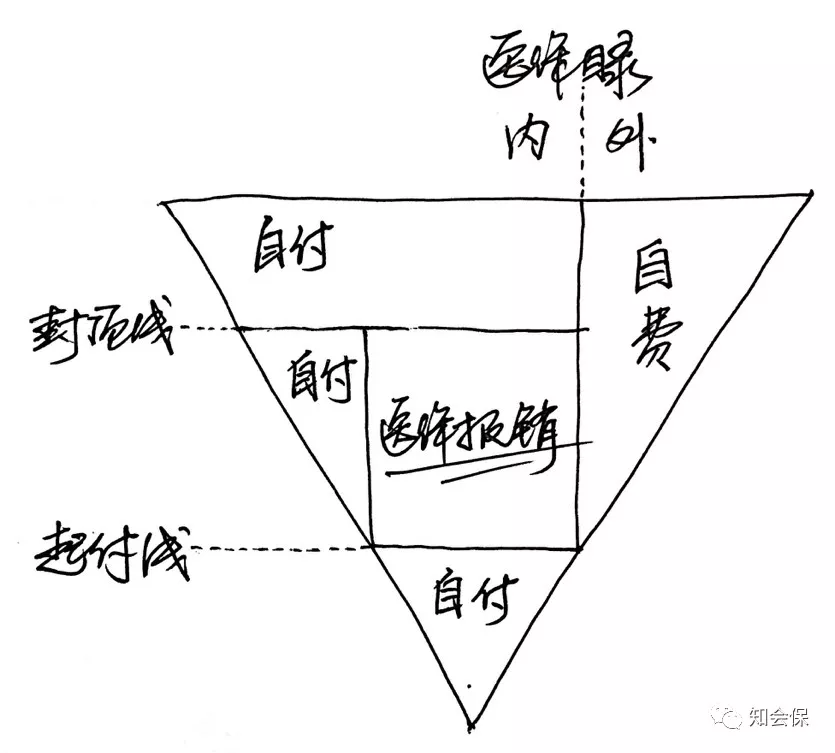

## **什么是医疗保险**

医疗保险是指以保险合同约定的医疗行为的发生为给付保险金条件，为被保险人接受诊疗期间的医疗费用支出提供保障的保险，属于人身险里的健康保险。

医疗费用是病人为了治病而发生的各种费用，一般包括门诊费用、药费、住院费用、护理费用、医院杂费、手术费用、各种检查费用、护理费用等。

医疗保险就是医疗费用保险的简称，所保障的医疗费用一般是一项或若干项医疗费用的组合。

## **社会保险和商业保险**

医疗保险被分为两种，强制性的社会医疗保险（简称社保或医保）和商业医疗保险。商业医疗险是个人自愿的、保险公司订立合同的保险，当被保险人因疾病或意外事故而发生医疗费用支出时，在扣除社保或其他途径获得的补偿金额后，保险公司对余下的部分给予保险合同规定的费用补偿。

无论是社会医疗险还是商业医疗保险，最大的作用在于报销一些大的医疗费用支出。

那么有了医保，是否还有必要购买商业医疗保险？这个问题的关键在于当发生高费用的医疗时，社保究竟能起多大作用。如果社保能全部报销，商业医疗保险则就没有必要了。

但现实并非如此。社保只提供最基本的医疗保障，很多必须的药品、器材和诊疗服务费用都是不给予赔付的。

## **认识社保的特征**

我国目前的社会医保体系由城镇职工基本医疗保险、城镇居民基本医疗保险和新农合三大制度组成，综合来看，有如下三个特征：

1. **医保目录**：诊疗目录、药品目录、服务设施目录；
2. **个人自付**：目录范围内的个人共担机制，包括免赔额，或称起付线、赔付比例（例如乙类药品）和报销封顶线，即部分费用需要个人承担；
3. **个人自费**：医保目录范围之外的医疗费用，完全由个人承担。

以下图做直观的说明，用一个大三角形表示全部医疗费用：

\*\***起付线**

起付线以下部分是需要个人自己承担的费用，起付线是根据各地医保政策而设定的。

**\*\* 封顶线**

通常医保报销设有一个上限，超过上限的部分需要由个人承担。各地区不同。

**\*\* 自付部分**

指个人按比例承担的部分。起付线以下、封顶线以上部分，由个人全部承担，起付线以上、封顶线以下，由个人按比例承担，这部分一般占比10%-40%不等，各地区不同。

**\*\* 自费部分**

指不在医保目录范围内部分，由个人承担。医保对药品和治疗项目有严格的规定，在治疗过程中因为一些进口药、特效药、医疗设备、医疗服务项目等都不予报销。而这一部分的费用通常来说是非常高的。

## **接受商保的价值**

**医保一般在扣除个人自费和个人自付后，才开始报销治疗费用,**也就是图中正方形部分为医保报销部分，即：

**医保报销 = 总费用 – 个人自费 – 个人自付**

一般情况下的医疗涉及的费用大多在封顶线以下，医保可以发挥一定的作用，此时，大家都会认为医保足够，不必再购买商业医疗保险。

但是在发生高昂的治疗费用后，自费和自付部分的费用就相当高了，**医保不予报销的部分，商业医疗保险就体现价值了**。

从以上的分析我们可以看出，一旦**发生大的医疗事故后，社保是有一定局限性**的。社保报销之外，个人可能需要承担很大一笔费用开销。不过这并不是说社保不重要，社保的缺点虽明显，但社保非常便宜，能上社保还是尽量要上社保。

购买一份好的商业医疗险后，不但价格不会很昂贵，自己负担的大部分费用在扣除商业医疗保险的免赔额（通常是1万元的免赔额）后，可以全部报销。

> 社会医疗保险搭配商业医疗保险后，可以很好的弥补重大医疗事故的费用支出。
>
> ——知会保

